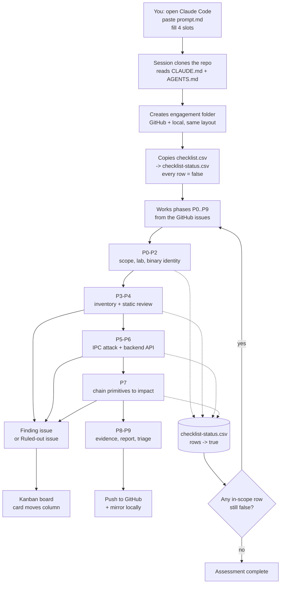

# flow.md — How the whole thing fits together

You give an APK. Everything else happens inside this system.

This document shows how the four pieces — **the prompt**, **the repo**, **the skill** and **the
engagement folder** — combine into one operation.

---

## 1. The four pieces

| Piece | What it is | Who reads it |
|---|---|---|
| [`prompt.md`](prompt.md) | The block you paste into a fresh Claude Code session | You, once per engagement |
| **This repository** | The methodology: SOP, checklist, docs, tools, issues, board | The Opus 5 session, on demand |
| [`skills/android-bounty/SKILL.md`](skills/android-bounty/SKILL.md) | A Claude Code skill that auto-loads the methodology whenever an APK is mentioned | Claude, automatically |
| [`BugBountyTarget/<Target>_<date>/`](BugBountyTarget/) | Where that engagement's evidence and findings live, on GitHub and locally | Every future session |

---

## 2. The flow



---

## 3. Step by step, with the commands

### Step 1 — You start a session

Open Claude Code anywhere (terminal, Android Studio, the desktop app). Paste
[`prompt.md`](prompt.md) with the four slots filled:

```
TARGET NAME      : Nisho
APK / PACKAGE    : ~/apks/nisho/base.apk
PROGRAM & SCOPE  : https://hackerone.com/nisho — Android app + api.nisho.com
AUTHORISATION    : public bounty programme
```

That is your entire involvement until findings appear.

### Step 2 — The session loads itself

```bash
git clone https://github.com/sanehunters/sane_android.git ~/sane_android
```

`CLAUDE.md` is auto-loaded by Claude Code. The session then reads `AGENTS.md` (the SOP),
`docs/02` (what counts as a finding) and `MASTER-CHECKLIST.md` (what to test), and lists the issues:

```bash
gh issue list --repo sanehunters/sane_android --limit 100 --state open
```

Issue **#1** is START HERE. Issues **#9–#18** are the ten phases. The **D01–D27** issues are the test
batteries, each naming the exact checklist file and item range it covers.

### Step 3 — The session creates its workspace

```bash
D=$(date +%d%m%Y)                                     # 07092026
cp -R ~/sane_android/BugBountyTarget/_TEMPLATE \
      ~/sane_android/BugBountyTarget/Nisho_$D
mkdir -p ~/AndroidStudioProjects/lamppentest/nisho
cp ~/sane_android/checklist.csv \
   ~/sane_android/BugBountyTarget/Nisho_$D/checklist-status.csv
```

Every row in `checklist-status.csv` starts `completed=false`. That file is the contract: the assessment
is not finished while an in-scope row is still `false`.

### Step 4 — The session works the phases

It walks P0 → P9, working each phase's domain issues. As each checkpoint is settled it flips the row to
`true` and records `result` (`finding` / `ruled-out` / `blocked` / `n/a`), the evidence path, and the
mechanism that closed it.

Findings and clean sweeps become GitHub issues, which land on the
[board](https://github.com/orgs/sanehunters/projects/1) and move through
`Testing → Evidence → Finding → Reported`, or straight to `Clean`.

### Step 5 — Everything is written twice, continuously

```
~/sane_android/BugBountyTarget/Nisho_07092026/     -> committed and pushed after every phase
~/AndroidStudioProjects/lamppentest/nisho/          -> the operator's local working tree
```

Never at the end. An engagement that exists only in a context window is lost work.

### Step 6 — You read the result

```bash
# what has been done and what is next
cat ~/sane_android/BugBountyTarget/Nisho_07092026/report/assessment-status.md

# the findings
cat ~/sane_android/BugBountyTarget/Nisho_07092026/report/findings-index.md

# coverage, as a number
python3 ~/sane_android/scripts/coverage.py \
        ~/sane_android/BugBountyTarget/Nisho_07092026/checklist-status.csv
```

Or on GitHub: the issue list filtered to `type: finding`, and the board.

---

## 4. Resuming, months later

This is the case the folder layout exists for.

```
STEP 1 - RESUME
An engagement folder already exists at ~/sane_android/BugBountyTarget/Nisho_07092026/
Read report/assessment-status.md FIRST. Resume from NEXT TARGET.
Do not re-walk anything in the RULED OUT section.
```

`assessment-status.md` carries `COMPLETED`, `IN PROGRESS`, `FINDINGS`, `RULED OUT`,
`NEXT TARGET (ordered by expected value)`, `BLOCKERS (stated, not faked)` and `CHAINING IDEAS`. A fresh
session reads it and continues rather than restarting.

`checklist-status.csv` tells it exactly which of the checkpoints are still `false`.

---

## 5. Working several targets

Every engagement is its own dated folder. They accumulate:

```
BugBountyTarget/
├── Nisho_07092026/
├── Blinkit_12082026/
├── Zomato_11092026/
└── Voi_29082026/
```

Which makes cross-target questions answerable:

```bash
# every finding we have ever produced, across all targets
grep -h '^| F-' BugBountyTarget/*/report/findings-index.md

# which targets had an exported-provider finding
grep -l 'D07-' BugBountyTarget/*/checklist-status.csv

# coverage across the portfolio
for f in BugBountyTarget/*/checklist-status.csv; do
  echo "$f: $(python3 scripts/coverage.py "$f" --brief)"
done
```

A pattern that paid on one target is the first thing to try on the next. That is the compounding the
folder structure is for.

---

## 6. What each piece is responsible for

| Question | Answered by |
|---|---|
| How do I start? | [`prompt.md`](prompt.md) |
| What are my standing orders? | [`CLAUDE.md`](CLAUDE.md) |
| What is my job, in full? | [`AGENTS.md`](AGENTS.md) |
| What do I do first, second, third? | [`ISSUES.md`](ISSUES.md) and the phase issues |
| What exactly do I test? | [`MASTER-CHECKLIST.md`](MASTER-CHECKLIST.md), [`checklist/`](checklist/) |
| Have I tested everything? | `checklist-status.csv` in the engagement folder |
| Is this worth reporting? | [`docs/02`](docs/02-severity-and-reportability.md) |
| Who is the attacker? | [`docs/05`](docs/05-attacker-models.md) |
| How do I prove it? | [`docs/04`](docs/04-poc-and-evidence-standard.md) |
| They pushed back — now what? | [`docs/06`](docs/06-triage-playbook.md) |
| Where does the output go? | [`BugBountyTarget/README.md`](BugBountyTarget/README.md) |
| What did we find last time? | `BugBountyTarget/*/report/findings-index.md` |

---

## 7. The one-line summary

> **You supply an APK and a scope. The session loads the SOP from this repo, opens a dated engagement
> folder, works 27 domains of checkpoints tracked as `true`/`false`, chains every primitive into a
> payable impact category, records what it ruled out and why, and pushes the evidence to GitHub and
> your Mac at the same time.**
